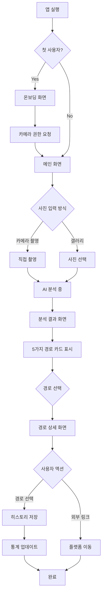
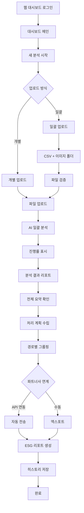
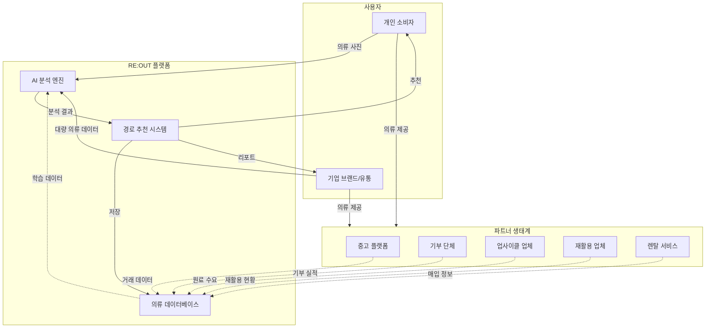
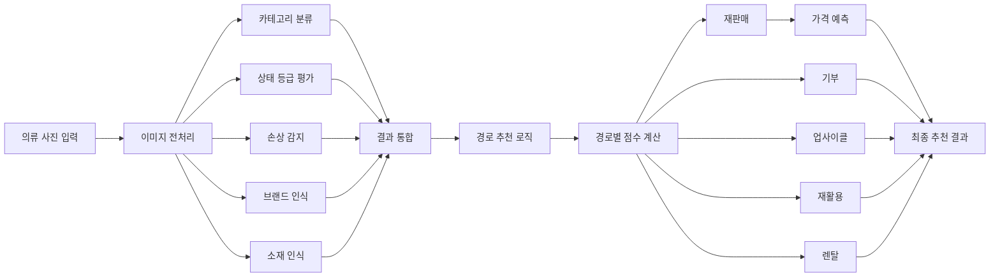
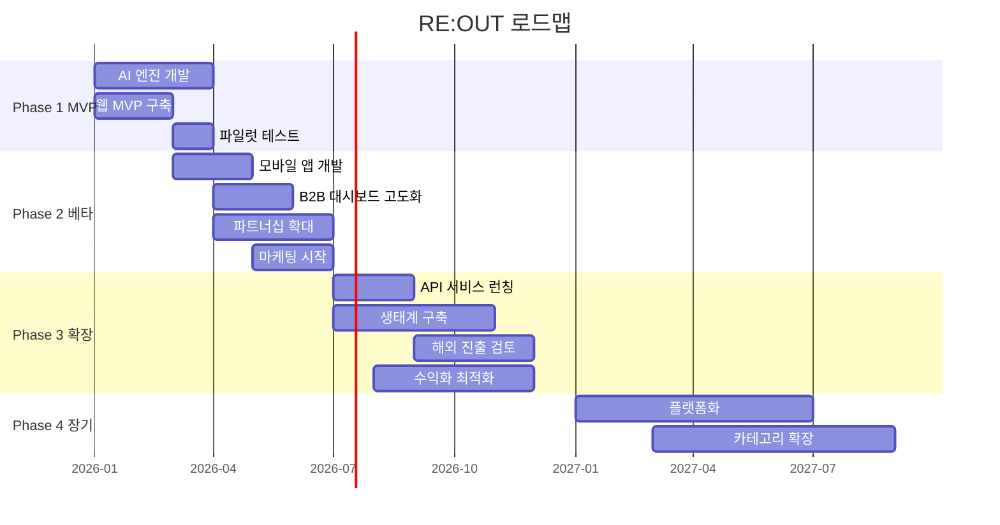

# RE:OUT(루트) 서비스 기획안

> **버리기 전 3초, 당신의 옷이 갈 가장 가치 있는 길을 찾으세요**

---

## 1. 프로젝트 개요

### 서비스명
**RE:OUT (루트)**

### 네이밍 의미
- **RE**: Recycle (재활용), Re-use (재사용)
- **OUT**: Output (배출), 새로운 출구
- **Route**: 헌 옷이 나가는 최적의 길(경로)을 찾아준다는 의미

### 슬로건
**"버리기 전 3초, 당신의 옷이 갈 가장 가치 있는 길을 찾으세요"**

### 한 줄 소개
AI 이미지 분석 기술로 의류의 상태를 자동 평가하고, 재판매·기부·업사이클·재활용·렌탈 등 최적의 재사용 경로를 3초 만에 추천하는 의류 자원 순환 플랫폼

### 비전
버려지는 모든 의류가 가장 가치 있는 곳으로 흐르는 세상을 만듭니다.

### 미션
- 의류 폐기 결정의 고민을 없애고, 누구나 쉽게 자원 순환에 참여할 수 있게 합니다
- AI 기술로 의류 분류 비용을 획기적으로 절감하여 순환 경제를 활성화합니다
- 개인과 기업 모두가 환경적 가치와 경제적 이익을 동시에 얻을 수 있도록 돕습니다

---

## 2. 배경 및 문제 정의

### 2.1 의류 폐기물 현황

#### 국내 현황
- 연간 의류 폐기량: **약 8만 톤** (2022년 기준)
- 의류 재활용률: **약 11%** (OECD 평균 15% 이하)
- 매립/소각되는 의류: **약 89%**
- 패스트 패션 확산으로 의류 수명 단축: 평균 **3년 → 1.5년**

#### 글로벌 현황
- 전 세계 연간 의류 폐기량: **9,200만 톤**
- 매년 생산되는 의류의 **87%가 소각 또는 매립**
- 패션 산업 탄소 배출: 전 세계 배출량의 **10%**
- 2030년까지 의류 폐기물 **60% 증가** 전망

### 2.2 현재 시장의 페인 포인트

#### 개인 소비자의 어려움
1. **의사결정 피로**: "이 옷을 버려야 할까? 팔 수 있을까? 기부해야 할까?"
   - 평균적으로 옷장 정리 시 **의류 1벌당 3분 이상 고민**
   - 결과적으로 많은 의류가 "일단 보관" 상태로 방치

2. **정보 탐색 비용**
   - 중고 거래 플랫폼별 가격 비교 필요
   - 기부처, 재활용 센터 위치 및 기준 확인 필요
   - 시간과 노력 부담으로 **결국 일반 쓰레기로 폐기**

3. **가치 판단의 어려움**
   - 내 옷의 중고 시장 가치를 모름
   - 어떤 상태까지 기부/재판매가 가능한지 불명확

#### 기업(패션 브랜드/유통)의 어려움
1. **재고 처리 비용 부담**
   - 시즌 오프 재고, 반품 상품 처리 비용 연간 **매출의 3-5%**
   - 단순 폐기 시 브랜드 이미지 손상 우려

2. **수작업 분류의 비효율**
   - 의류 상태 평가 및 분류에 **인건비 과다 소요**
   - 숙련된 인력 필요, 주관적 판단으로 일관성 부족
   - 대량 재고 처리 시 **몇 주~몇 달 소요**

3. **ESG 경영 압력**
   - 친환경 경영 요구 증가
   - 의류 순환 프로그램 운영 필요성 증가
   - 구체적 실행 방안 부재

#### 재활용/업사이클링 업체의 어려움
1. **원료 소싱의 불확실성**
   - 양질의 의류 원료 확보 어려움
   - 수작업 선별로 원가 상승
   - 공급망 불안정

---

## 3. 솔루션

### 3.1 핵심 가치 제안

**"사진 한 장, 3초면 충분합니다"**

RE:OUT은 AI 이미지 분석 기술로 의류의 상태를 즉시 평가하고, 해당 의류가 갈 수 있는 최적의 경로를 자동으로 추천합니다. 더 이상 고민하거나 검색할 필요 없이, 가장 가치 있는 선택을 바로 할 수 있습니다.

### 3.2 차별화 포인트

#### 1. 초간편 사용성
- **사진 한 장으로 즉시 분석**: 별도의 정보 입력 불필요
- **3초 내 결과 제공**: 실시간 분석 및 추천
- **직관적 UI/UX**: 기술을 몰라도 누구나 사용 가능

#### 2. 다차원 경로 제시
- 단순 "버려라/팔아라"가 아닌 **5가지 재사용 경로** 제시
- 각 경로별 **예상 가치 산출** (금액, 환경 기여도)
- 사용자가 **가치관에 따라 선택** 가능

#### 3. 통합 플랫폼
- 중고 플랫폼, 기부처, 업사이클링 업체 등 **파트너사 네트워크 연결**
- 한 곳에서 모든 정보 확인 및 연계 가능
- 별도 검색 및 비교 불필요

#### 4. B2B & B2C 동시 공략
- 개인 사용자: 간편한 모바일 앱
- 기업 사용자: 대량 처리 가능한 대시보드
- 확장 가능한 아키텍처로 양쪽 시장 동시 확보

#### 5. 데이터 기반 의사결정
- AI 분석으로 **객관적이고 일관된 평가**
- 누적 데이터 기반 **추천 정확도 지속 향상**
- 사용자 피드백 루프로 학습

---

## 4. 타겟 시장 및 고객 분석

### 4.1 Primary Target (MVP 단계)

#### B2B - 패션 브랜드 / 제조사
- **페르소나**: 중소형~중견 패션 브랜드 ESG 담당자
- **니즈**: 시즌 오프 재고, 불량품, 반품 의류 처리
- **규모**: 연간 500~10,000벌 처리
- **주요 관심사**: 비용 절감, ESG 성과, 브랜드 이미지

#### B2B - 리테일 / 유통업체
- **페르소나**: 백화점, 아울렛, 온라인 쇼핑몰 운영팀
- **니즈**: 미판매 재고, 반품 상품 재활용
- **규모**: 월 1,000벌 이상
- **주요 관심사**: 재고 회전율, 처리 속도, 공간 확보

#### B2B - 재활용 / 업사이클링 업체
- **페르소나**: 업사이클 브랜드, 섬유 재활용 공장
- **니즈**: 양질의 원료 소싱, 효율적 분류
- **규모**: 월 5,000벌 이상 원료 필요
- **주요 관심사**: 원료 품질, 공급 안정성, 원가 절감

### 4.2 Secondary Target (확장 단계)

#### B2C - 개인 소비자
- **페르소나 1**: 20-30대 직장인, 옷장 정리 필요
  - 니즈: 간편한 중고 판매, 의사결정 지원
  - 빈도: 분기별 1회, 5-20벌

- **페르소나 2**: 30-40대 부모, 아이 옷 정리
  - 니즈: 빠르게 자라는 아이 옷 처리
  - 빈도: 시즌별 1회, 10-30벌

- **페르소나 3**: 미니멀리스트 / 환경 의식 소비자
  - 니즈: 지속가능한 소비, 환경 기여
  - 빈도: 정기적, 소량

### 4.3 시장 규모 및 기회

#### 국내 시장
- **패션 산업 규모**: 약 50조 원 (2023년)
- **중고 의류 시장**: 약 3조 원 (연평균 15% 성장)
- **의류 재활용 산업**: 약 5,000억 원
- **ESG 투자 확대**: 대기업 중심 의류 순환 프로그램 증가

#### 잠재 고객 규모
- **B2B 타겟**: 국내 패션 브랜드 약 3,000개, 유통업체 500개
- **B2C 타겟**: 온라인 중고 거래 이용자 약 1,500만 명
- **TAM (Total Addressable Market)**: 약 5조 원
- **SAM (Serviceable Available Market)**: 약 5,000억 원
- **SOM (Serviceable Obtainable Market, 3년 내)**: 약 500억 원

#### 시장 트렌드
- **중고 거래 플랫폼 급성장**: 당근마켓, 번개장터, 네이버 중고나라 등
- **ESG 경영 의무화**: 2025년부터 자산 2조 원 이상 기업 ESG 공시 의무
- **순환경제 정책 강화**: 정부 '순환경제 활성화 종합대책' 발표
- **MZ세대 가치소비 확산**: 환경을 고려한 소비 증가

---

## 5. 주요 기능 (MVP 중심)

### 5.1 핵심 기능: AI 분석 & 경로 추천

#### 입력
- **방법 1**: 앱/웹 카메라로 직접 촬영
- **방법 2**: 갤러리에서 기존 사진 선택
- **방법 3 (B2B)**: 여러 장 일괄 업로드

#### AI 분석 항목

**1. 의류 카테고리 자동 인식**
- 상의 (티셔츠, 셔츠, 블라우스, 니트 등)
- 하의 (청바지, 슬랙스, 스커트 등)
- 아우터 (재킷, 코트, 패딩 등)
- 원피스
- 기타 (액세서리, 가방, 신발 등)

**2. 상태 등급 평가**
- **S등급**: 신품 또는 신품 수준 (택 부착 가능)
- **A등급**: 사용감 거의 없음, 세탁 후 판매 가능
- **B등급**: 사용감 있으나 양호, 중고 판매 또는 기부 적합
- **C등급**: 손상 있으나 활용 가능, 업사이클/재활용 적합
- **D등급**: 심각한 손상, 섬유 재활용만 가능

**3. 손상 유형 감지**
- 얼룩 (위치, 크기, 종류)
- 찢어짐 / 구멍
- 변색 / 바래짐
- 보풀 / 늘어남
- 손상 없음

**4. 브랜드 인식 (선택)**
- 로고 또는 라벨 인식
- 명품 브랜드 우선 인식
- 브랜드별 중고 시장 가치 반영

**5. 소재 인식**
- 면 / 폴리에스터 / 울 / 실크 / 혼방 등
- 재활용 가능성 판단에 활용

#### 추천 경로 및 제공 정보

**경로 1: 재판매 (중고 플랫폼)**
- **적합 조건**: S~B등급, 손상 경미
- **예상 판매가**: AI 기반 시세 예측 (예: 15,000~25,000원)
- **추천 플랫폼**: 
  - 당근마켓 (근거리 직거래)
  - 번개장터 (택배 거래)
  - 네이버 중고나라
  - 전문 중고 플랫폼 (명품: 머스트잇 리셀, 캐주얼: 빈티지 샵)
- **예상 소요 시간**: 등록 5분, 판매 1주~1개월
- **환경 기여도**: CO2 약 3kg 절감 (새 옷 구매 대비)

**경로 2: 기부**
- **적합 조건**: B~C등급, 착용 가능한 상태
- **추천 기부처**:
  - 아름다운가게 (의류 재판매)
  - 굿윌스토어 (취약계층 지원)
  - 옷캔 (의류 수거함, 위치 안내)
  - 단체별 수거 조건 안내
- **세액 공제**: 기부금 영수증 발급 가능 여부
- **예상 소요 시간**: 수거함 방문 10분 또는 택배 발송
- **환경 기여도**: CO2 약 2.5kg 절감

**경로 3: 업사이클링 (리메이크)**
- **적합 조건**: C등급, 디자인/소재가 독특한 경우
- **연계 업체**:
  - 업사이클 브랜드 (컨티뉴, 래;코드, 플리츠마마 등)
  - 리폼 서비스 (수선집 연계)
  - DIY 아이디어 제공
- **예상 비용/수익**: 리메이크 제품 구매 시 할인 또는 원료 판매
- **예상 소요 시간**: 상담 후 결정
- **환경 기여도**: CO2 약 4kg 절감 (새 제품 제작 대비)

**경로 4: 재활용 (섬유 재생)**
- **적합 조건**: D등급, 착용 불가 상태
- **처리 방법**:
  - 의류 수거함 (재활용 전용)
  - 주민센터 / 구청 수거 서비스
  - 택배 수거 서비스 (일부 지역)
- **재활용 방식**: 섬유 분해 후 산업용 원료, 단열재 등으로 재가공
- **예상 소요 시간**: 수거함 방문 10분
- **환경 기여도**: CO2 약 1.5kg 절감 (매립 대비)

**경로 5: 렌탈 서비스 원료**
- **적합 조건**: A~B등급, 유행 타지 않는 베이직 아이템
- **연계 서비스**:
  - 의류 구독 렌탈 서비스
  - 유니폼/행사복 렌탈
- **예상 수익**: kg당 또는 벌당 매입가 제시
- **예상 소요 시간**: 택배 발송
- **환경 기여도**: CO2 약 3.5kg 절감

### 5.2 부가 기능

#### 의류 이력 관리
- 분석한 의류 목록 자동 저장
- 카테고리별, 날짜별 정렬
- 처리 상태 트래킹 (대기/진행중/완료)
- 사진, 분석 결과, 선택한 경로 기록

#### 통계 대시보드
- **개인 사용자**:
  - 누적 처리 의류 수
  - 총 환경 기여도 (CO2 절감량)
  - 예상/실제 수익 합계
  - 월별 활동 그래프
  
- **기업 사용자**:
  - 처리 의류 통계 (등급별, 카테고리별)
  - 경로별 분배 현황
  - 비용 절감 효과 분석
  - ESG 리포트 자동 생성

#### 일괄 처리 (B2B 전용)
- CSV + 이미지 폴더 업로드
- 최대 1,000벌 동시 분석
- 분석 진행률 실시간 표시
- 결과 엑스포트 (Excel, PDF)
- 경로별 자동 분류 및 라벨 출력

#### 추천 경로 북마크 / 공유
- 마음에 드는 경로 저장
- 가족/친구에게 공유 (링크)
- SNS 공유 (환경 기여 인증)

---

## 6. 사용자 플로우

### 6.1 B2C 개인 사용자 플로우



### 6.2 B2B 기업 사용자 플로우



### 6.3 RE:OUT 서비스 생태계



### 6.4 AI 분석 프로세스



---

## 7. 비즈니스 모델

MVP 단계에서는 비즈니스 모델을 확정하기보다 **여러 옵션을 테스트**하며 최적의 모델을 찾아갑니다.

### Option 1: SaaS 구독 모델

#### 구조
- **B2B 고객**: 월/연 구독료 과금
- **B2C 개인**: 무료 또는 Freemium

#### 가격 티어 (예시)
| 티어 | 월 분석 가능 건수 | 가격 | 주요 고객 |
|------|-------------------|------|-----------|
| Free | 10건 | 무료 | 개인 사용자 |
| Basic | 100건 | 50,000원/월 | 소규모 브랜드 |
| Pro | 500건 | 200,000원/월 | 중소 브랜드/유통 |
| Enterprise | 무제한 | 커스텀 | 대기업, 제조사 |

#### 장점
- 예측 가능한 매출
- 고객 락인 효과
- 초기 현금 흐름 확보

#### 단점
- B2C 전환 장벽 높음
- 초기 고객 확보 어려움

---

### Option 2: 플랫폼 중개 수수료 모델

#### 구조
- **분석 서비스**: 무료 제공
- **거래 성사 시**: 수수료 부과

#### 수수료 예시
- 재판매: 거래액의 5-10%
- 업사이클링 연결: 건당 5,000원
- 렌탈 업체 연결: 매입가의 10%

#### 장점
- 사용자 진입 장벽 없음
- 빠른 사용자 확보 가능
- 네트워크 효과 기대

#### 단점
- 초기 매출 부족
- 파트너사 의존도 높음
- 수익화까지 시간 소요

---

### Option 3: API 제공 모델

#### 구조
- 중고 플랫폼, 패션 앱, 유통사에 **AI 분석 API** 제공
- 호출 건수 기반 과금

#### 가격 예시
- 1,000건: 100,000원
- 10,000건: 800,000원
- 100,000건: 6,000,000원

#### 장점
- B2B 위주로 빠른 수익화
- 기술 집중 가능
- 확장성 높음

#### 단점
- 직접 사용자 확보 어려움
- 브랜드 인지도 낮음
- 경쟁사 대응 어려움

---

### Option 4: 하이브리드 모델 (추천)

#### 구조
- **B2B**: SaaS 구독 + 대량 할인
- **B2C**: Freemium (기본 무료) + 프리미엄 기능 유료 + 거래 수수료

#### B2C 프리미엄 기능 (월 5,900원)
- 무제한 분석
- 우선 고객 지원
- 상세 통계 및 인사이트
- 광고 제거

#### 장점
- 다양한 수익원 확보
- 시장별 최적화 전략
- 리스크 분산

#### 단점
- 운영 복잡도 증가

---

## 8. 성공 지표 (KPI)

### 8.1 사용자 지표

| 지표 | MVP 목표 (3개월) | 베타 목표 (6개월) | 본격 확장 (12개월) |
|------|------------------|-------------------|-------------------|
| **B2B 기업 고객** | 10개 | 50개 | 200개 |
| **B2C MAU** | 1,000명 | 10,000명 | 100,000명 |
| **일 분석 건수** | 100건 | 1,000건 | 10,000건 |
| **월 분석 건수** | 3,000건 | 30,000건 | 300,000건 |

### 8.2 비즈니스 지표

| 지표 | MVP 목표 | 베타 목표 | 본격 확장 |
|------|----------|-----------|----------|
| **MRR (월 반복 매출)** | 500만원 | 3,000만원 | 2억원 |
| **고객 유지율** | 70% | 80% | 85% |
| **CAC (고객 획득 비용)** | 100,000원 | 50,000원 | 30,000원 |
| **LTV (고객 생애 가치)** | 500,000원 | 1,000,000원 | 2,000,000원 |

### 8.3 서비스 품질 지표

| 지표 | 목표 |
|------|------|
| **AI 분석 정확도** | 90% 이상 |
| **분석 소요 시간** | 3초 이하 |
| **재사용 경로 채택률** | 60% 이상 |
| **사용자 만족도 (NPS)** | 50 이상 |
| **앱 평점** | 4.5/5.0 이상 |

### 8.4 임팩트 지표

| 지표 | 누적 목표 (12개월) |
|------|-------------------|
| **재사용된 의류 수** | 100만 벌 |
| **CO2 절감량** | 3,000톤 |
| **폐기 비용 절감** | 50억원 |

---

## 9. 로드맵



### Phase 1: MVP 개발 및 파일럿 (1-3개월)

#### 목표
- 핵심 기능 구현 및 검증
- 소수 B2B 고객 파일럿 테스트
- 초기 피드백 수집

#### 주요 작업
- **AI 엔진 개발**
  - 의류 카테고리 분류 모델
  - 상태 등급 평가 모델
  - 손상 감지 모델
  - 초기 학습 데이터셋 구축 (5,000장 이상)

- **웹 기반 MVP**
  - 간단한 업로드 인터페이스
  - 분석 결과 표시
  - 5가지 경로 추천 로직
  - 기본 히스토리 기능

- **파트너사 리서치**
  - 중고 플랫폼 시세 데이터 수집
  - 기부처, 업사이클 업체 리스트 구축
  - 초기 파트너십 협의 (3-5곳)

- **파일럿 테스트**
  - 중소 패션 브랜드 3-5개사
  - 각 100-500벌 분석
  - 피드백 수집 및 개선

#### 성공 기준
- AI 정확도 85% 이상
- 파일럿 고객 만족도 80% 이상
- 분석 소요 시간 5초 이하

---

### Phase 2: 베타 런칭 및 시장 진입 (4-6개월)

#### 목표
- B2C 모바일 앱 출시
- B2B 고객 확대
- 브랜드 인지도 구축

#### 주요 작업
- **B2C 모바일 앱 개발**
  - iOS / Android 네이티브 앱
  - 직관적 UI/UX
  - 카메라 촬영 최적화
  - 푸시 알림, 공유 기능

- **B2B 대시보드 고도화**
  - 일괄 업로드 기능
  - 상세 리포트 및 통계
  - 엑스포트 기능
  - 멀티 유저 / 권한 관리

- **파트너십 확대**
  - 주요 중고 플랫폼 연계 (당근마켓, 번개장터 등)
  - 기부 단체 공식 파트너십 (아름다운가게, 굿윌스토어 등)
  - 업사이클 브랜드 5-10곳 연결

- **마케팅 시작**
  - 환경 의식 타겟 SNS 광고
  - 패션/라이프스타일 인플루언서 협업
  - PR: 환경 미디어, 스타트업 매체
  - SEO 및 콘텐츠 마케팅

- **AI 고도화**
  - 브랜드 인식 기능 추가
  - 소재 인식 정확도 향상
  - 사용자 피드백 기반 재학습

#### 성공 기준
- B2C MAU 10,000명
- B2B 고객 50개사
- 앱 스토어 평점 4.3 이상
- AI 정확도 90% 이상

---

### Phase 3: 본격 확장 및 수익화 (7-12개월)

#### 목표
- 시장 리더십 확보
- 수익화 본격화
- 생태계 구축

#### 주요 작업
- **기능 확장**
  - AI 분석 고도화 (명품 진위 여부 판별 등)
  - 커뮤니티 기능 (의류 교환, 나눔)
  - 게이미피케이션 (환경 기여 뱃지, 리더보드)
  - B2B 고급 분석 (트렌드 인사이트, 재고 최적화 제안)

- **API 서비스 런칭**
  - 중고 플랫폼, 패션 앱 대상
  - 개발자 문서 및 SDK 제공
  - 샌드박스 환경

- **파트너 생태계 구축**
  - 파트너사 포털 구축
  - 실시간 매칭 시스템
  - 파트너사 리뷰 및 평가

- **해외 진출 검토**
  - 일본, 동남아 시장 조사
  - 현지 파트너 탐색
  - 다국어 지원 준비

- **수익화 최적화**
  - A/B 테스트 (가격, UI/UX)
  - 전환율 최적화
  - 구독/수수료 믹스 조정

#### 성공 기준
- B2C MAU 100,000명
- B2B 고객 200개사
- MRR 2억원 이상
- 재사용 의류 누적 100만 벌

---

### Phase 4: 장기 비전 (12개월 이후)

- **플랫폼화**: 의류 순환 생태계의 중심
- **카테고리 확장**: 가구, 전자제품 등 다른 카테고리로 확장
- **B2B2C 모델**: 브랜드가 자사 고객에게 RE:OUT 제공
- **글로벌 확장**: 주요 국가 진출
- **데이터 비즈니스**: 패션 트렌드, 소비자 인사이트 판매

---

## 10. 리스크 및 대응 방안

### 10.1 기술적 리스크

#### 리스크: AI 분석 정확도 미달
- **원인**: 학습 데이터 부족, 다양한 조명/각도 대응 부족
- **대응**:
  - 초기 데이터셋 확보: 파트너사 협업, 크라우드소싱
  - 사용자 피드백 루프: "이 분석이 정확한가요?" 평가 기능
  - 단계적 출시: 특정 카테고리(예: 상의)부터 시작
  - 불확실 시 복수 옵션 제시

#### 리스크: 분석 속도 지연
- **원인**: 서버 부하, 모델 최적화 부족
- **대응**:
  - 클라우드 오토스케일링
  - 모델 경량화 (모바일 엣지 추론 검토)
  - 대기열 시스템 구현

---

### 10.2 비즈니스 리스크

#### 리스크: 파트너사 확보 어려움
- **원인**: 신생 서비스 신뢰도 부족, 제휴 협상 난항
- **대응**:
  - 초기에는 파트너 연결 없이 **정보 제공**만으로 시작
  - 기존 플랫폼 공개 데이터 수집 (크롤링, API)
  - 소규모 업체부터 접근 (업사이클 스튜디오, 지역 기부처)
  - 파일럿 성과 데이터로 신뢰 구축 후 대형 파트너 협상

#### 리스크: 수익화 지연
- **원인**: Freemium 전환율 저조, B2B 영업 부진
- **대응**:
  - 정부 지원 사업 활용 (환경부, 중소벤처기업부)
  - 투자 유치로 런웨이 확보
  - 초기 수익보다 사용자 확보 우선 (네트워크 효과)
  - B2B 위주 빠른 수익화

#### 리스크: 사용자 확보 실패
- **원인**: 니즈 불일치, 사용 동기 부족
- **대응**:
  - 명확한 가치 제안: "3초로 돈 벌기" (B2C), "비용 50% 절감" (B2B)
  - 인센티브 제공: 첫 거래 수수료 무료, 쿠폰 증정
  - 바이럴 마케팅: 친구 추천 이벤트
  - 환경 기여 가시화: "당신은 나무 10그루를 살렸어요"

---

### 10.3 시장 리스크

#### 리스크: 경쟁사 출현
- **원인**: 진입 장벽 낮음, 대기업 진입 가능성
- **대응**:
  - **빠른 시장 선점**: First mover advantage
  - **네트워크 효과**: 파트너사, 사용자 데이터 축적
  - **차별화**: 단순 분석이 아닌 생태계 구축
  - **브랜드 구축**: 환경 가치와 강한 연결

#### 리스크: 중고 시장 침체
- **원인**: 경기 침체, 소비 감소
- **대응**:
  - 경기 침체 시 오히려 중고 거래 증가 (역사적 경향)
  - 재판매 외 다양한 경로 제시 (기부, 재활용)
  - B2B 시장은 ESG 의무화로 안정적 수요

---

### 10.4 운영 리스크

#### 리스크: 품질 이슈 (잘못된 추천)
- **원인**: AI 오류, 시세 정보 오류
- **대응**:
  - 면책 고지: "추천은 참고용, 최종 결정은 사용자"
  - 신고 기능: 오류 제보 및 빠른 수정
  - 지속적 모니터링 및 개선

#### 리스크: 개인정보 보호 이슈
- **원인**: 의류 사진에 개인 정보 포함 가능성
- **대응**:
  - 최소 정보 수집
  - 사진 자동 삭제 옵션
  - 개인정보처리방침 명확화
  - GDPR, 개인정보보호법 준수

---

### 10.5 MVP 구현 전략 및 기술 스펙

#### 구현 가능성 검증

RE:OUT의 핵심 기술은 **이미 검증된 기술의 조합**입니다:

**✅ 이미지 인식 AI**
- Google Vision API: 의류 카테고리, 라벨 OCR 95%+ 정확도
- OpenAI GPT-4 Vision: 이미지 설명 및 상태 평가
- 학습 없이도 즉시 사용 가능

**✅ 가격 예측**
- 중고 플랫폼 공개 거래 데이터 수집
- 간단한 회귀 모델로 범위 예측 가능

**✅ 웹/모바일 개발**
- React 기반 SPA (Single Page Application)
- Tailwind CSS로 빠른 UI 구현
- Vercel 무료 배포

#### MVP 핵심 기능 (실제 구현)

**Phase 0: 데모 버전 (1-2일)**
```
✅ 이미지 업로드 UI
✅ Google Vision API 연동
  - 라벨 텍스트 인식 (OCR)
  - 이미지 속성 분석 (색상, 패턴)
✅ OpenAI Vision API 연동
  - "이 의류는 어떤 상태인가?" 질문
  - 등급(S/A/B/C/D) 자동 분류
✅ 규칙 기반 경로 추천
  - 등급에 따라 5가지 경로 우선순위 결정
✅ 결과 화면 및 상세 정보
✅ 모바일 반응형 UI
✅ Vercel 배포
```

**Phase 1: 베타 버전 (1주)**
- 실제 중고 거래 데이터 크롤링 → 가격 예측
- 사용자 피드백 수집
- 분석 정확도 개선

#### 기술 스택

```yaml
Frontend:
  - React 18 + Vite
  - Tailwind CSS
  - React Router (페이지 전환)
  
Backend (서버리스):
  - Vercel Serverless Functions
  - Google Vision API
  - OpenAI GPT-4 Vision API
  
Database:
  - 초기: LocalStorage (클라이언트)
  - 확장: Supabase (무료)
  
Deployment:
  - Vercel (자동 배포)
  - GitHub Actions (CI/CD)
```

#### 개발 일정 (1일 집중 개발)

```
🕐 09:00-11:00 (2시간) - 프로젝트 셋업 & 기본 UI
  ✓ Vite + React 프로젝트 생성
  ✓ Tailwind 설정
  ✓ 기본 레이아웃 (헤더, 푸터, 라우팅)
  ✓ 업로드 페이지 UI

🕐 11:00-13:00 (2시간) - AI API 연동
  ✓ Google Vision API 키 발급
  ✓ OpenAI API 키 발급
  ✓ 이미지 → AI 분석 파이프라인 구축
  ✓ 결과 파싱 및 등급 분류 로직

🕐 13:00-14:00 (1시간) - 점심 & 테스트

🕐 14:00-16:00 (2시간) - 결과 화면 & 경로 추천
  ✓ 5가지 경로 카드 UI
  ✓ 경로별 상세 페이지
  ✓ 환경 임팩트 계산 로직
  ✓ 애니메이션 & 인터랙션

🕐 16:00-17:00 (1시간) - 배포 & 최적화
  ✓ Vercel 연동
  ✓ 환경 변수 설정 (API 키)
  ✓ 모바일 테스트
  ✓ 성능 최적화

🕐 17:00-18:00 (1시간) - 발표 준비
  ✓ 피칭 덱 10장 제작
  ✓ 데모 시나리오 작성
  ✓ 리허설
```

#### 비용 구조 (무료/최소 비용)

```
Google Vision API: 월 1,000건 무료
OpenAI GPT-4 Vision: $0.01/이미지 (데모 100건 = $1)
Vercel 호스팅: 무료
Supabase DB: 무료 (500MB)
도메인: Vercel 기본 도메인 무료

총 데모 비용: 약 $1-2 (1,000~2,000원)
```

#### 실제 구현 샘플 코드 구조

```javascript
// src/services/aiAnalysis.js
export async function analyzeClothing(imageFile) {
  // 1. Google Vision으로 라벨/텍스트 인식
  const visionResult = await googleVisionOCR(imageFile);
  
  // 2. OpenAI Vision으로 상태 평가
  const openaiResult = await openaiVisionAnalysis(imageFile);
  
  // 3. 결과 통합
  return {
    category: openaiResult.category,
    grade: openaiResult.grade,
    damage: openaiResult.damage,
    brand: visionResult.detectedBrand,
    material: visionResult.detectedMaterial,
    recommendedPaths: calculatePaths(openaiResult.grade)
  };
}
```

---

## 11. 결론 및 넥스트 스텝

### 11.1 왜 지금인가?

1. **ESG 의무화**: 기업의 환경 책임 강화, 의류 순환 필요성 증가
2. **중고 시장 폭발적 성장**: 연평균 15% 성장, 대중화
3. **AI 기술 성숙**: 이미지 인식 정확도 및 속도 비약적 발전
4. **소비자 인식 변화**: MZ세대 중심 가치소비, 환경 의식 확산

### 11.2 RE:OUT의 임팩트

- **개인**: 의류 처리 고민 해소, 부수익 창출, 환경 기여 실천
- **기업**: 재고 처리 비용 50% 이상 절감, ESG 성과 확보, 브랜드 이미지 개선
- **사회**: 의류 폐기물 감소, CO2 배출 절감, 순환 경제 활성화
- **환경**: 연간 수천 톤의 CO2 절감, 매립지 부담 감소

### 11.3 넥스트 스텝

1. **와이어프레임 및 디자인 가이드 제작** (예정)
   - 사용자 경험 시나리오 구체화
   - UI/UX 디자인 시스템 구축

2. **기술 스펙 정의**
   - AI 모델 선정 및 개발 계획
   - 시스템 아키텍처 설계
   - 기술 스택 결정

3. **초기 파트너 발굴**
   - 파일럿 테스트 참여 기업 모집
   - 업사이클 업체, 기부처 사전 협의

4. **투자 유치 준비**
   - 피칭 덱 제작
   - 시장 조사 심화
   - 시드 투자 라운드 준비

---

**RE:OUT은 단순한 앱이 아닙니다.**  
**버려지는 옷에 새로운 길을 열어주는, 의류 순환 생태계의 시작입니다.**

**버리기 전 3초, 지금 시작하세요.**
